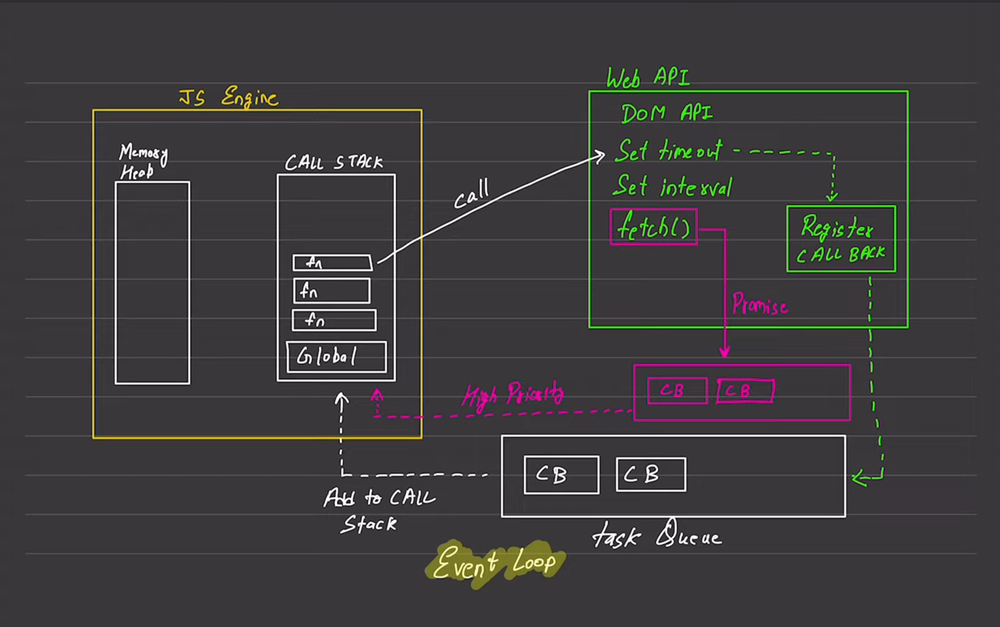

## JavaScript ---> 
1. Syncronous           (This is a default behaviour)
2. Single Threaded

### Execute one line of code at a time 
### Each operation waits for the last one to complete before executing

### Blocking Code ---> Blocks The Flow Of The Program ---> Read File Sync
### Non-Blocking Code ---> Doesn't Block The Flow Of The Program ---> Read File Async
### (Their Usage Depends On The UseCase)

# The JavaScript Event Loop Model

This document explains the components of the JavaScript runtime environment as illustrated in the "Event Loop" diagram.

## 1. JS Engine
The "brain" of JavaScript where code is parsed and executed. It consists of two main parts:
* **Memory Heap:** The large unstructured region (on the left) where memory allocation happens. This is where all your variables, objects, and functions are stored.
* **Call Stack:** The region (on the right) that keeps track of where we are in the code.
    * **LIFO (Last In, First Out):** It works like a stack of plates. The last function added is the first one to be finished.
    * **Global:** The bottom block representing the global execution context (the main script).
    * **fn (Function):** Represents function calls stacked on top of each other. When a function returns, it is popped off this stack.

## 2. Web API
These are features provided by the browser (or Node.js environment), not the JavaScript language itself.
* **DOM API:** Tools to manipulate HTML documents.
* **SetTimeout / SetInterval:** Timers used to delay code execution.
* **fetch():** Used for making network requests (fetching data from a server).
* **Register CALLBACK:** When you call an asynchronous function (like a timer), the browser registers a "callback" function to be run later, once the task is done.

## 3. The Queues (Waiting Rooms)
When a Web API task finishes, it doesn't go straight back to the Call Stack. It goes to a queue to wait its turn.

### Task Queue (Callback Queue)
* **Standard Priority:** Contains callbacks from things like `setTimeout` or `setInterval`.
* **CB (Callback):** The blocks inside represent the code waiting to run.
* **Flow:** Once the timer finishes, the callback moves here.

### Microtask Queue (High Priority)
* **High Priority:** Shown in pink/purple in the diagram. This queue is for **Promises** (like those returned by `fetch()`).
* **Priority Rule:** The Event Loop will always clear the Microtask Queue *before* touching the standard Task Queue. This means a `fetch().then()` callback will run before a `setTimeout` callback, even if they finish at the same time.

## 4. The Event Loop
This is the continuous process (represented by the cycle at the bottom) that monitors the **Call Stack** and the **Queues**.

**The Logic:**
1.  Is the **Call Stack** empty?
2.  If **YES**:
    * First, check the **Microtask Queue** (High Priority). If there are tasks, move them to the Call Stack immediately.
    * If the Microtask Queue is empty, check the **Task Queue** and move the next item to the Call Stack.
3.  If **NO**: Wait until the Call Stack is empty.

---

### In Simple Terms:
Imagine a restaurant kitchen:
1.  **Call Stack:** The chef (single-threaded). He can only chop one onion at a time.
2.  **Web APIs:** The ovens and appliances. The chef puts a turkey in the oven (`setTimeout`) and goes back to chopping. He doesn't stare at the oven waiting for it to finish.
3.  **Queues:** The "Ready" tickets. When the oven dings, a ticket is placed on the counter.
4.  **Event Loop:** The manager who checks, "Is the chef free? Okay, grab the next ticket."
